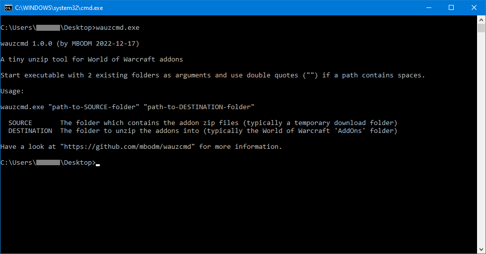

# wauzcmd
A tiny command line unzip tool for World of Warcraft addons 

### What it is
This is the command line version of [WAUZ](https://github.com/mbodm/wauz). It works exactly the same way as his "big brother" does. It is platform independent and written in Rust.

### How it works
Exactly the same way as [WAUZ](https://github.com/mbodm/wauz) does. Instead of selecting the 2 folders in a UI, just pass this 2 folders as command line arguments to the _wauzcmd.exe_ application. A few notes here:
- Use absolute folder paths.
- Use double quotes ("") if a folder path contains spaces.
- Both folders have to exist before starting the application.

### Why it exists
Because i promised that in the "[Notes](https://github.com/mbodm/wauz#notes)" section of the [WAUZ](https://github.com/mbodm/wauz) page.

### Requirements

- 64-bit Windows

There are not any other special requirements. It is written in Rust and natively compiled for the Windows x64 platform.

#### Have fun.
